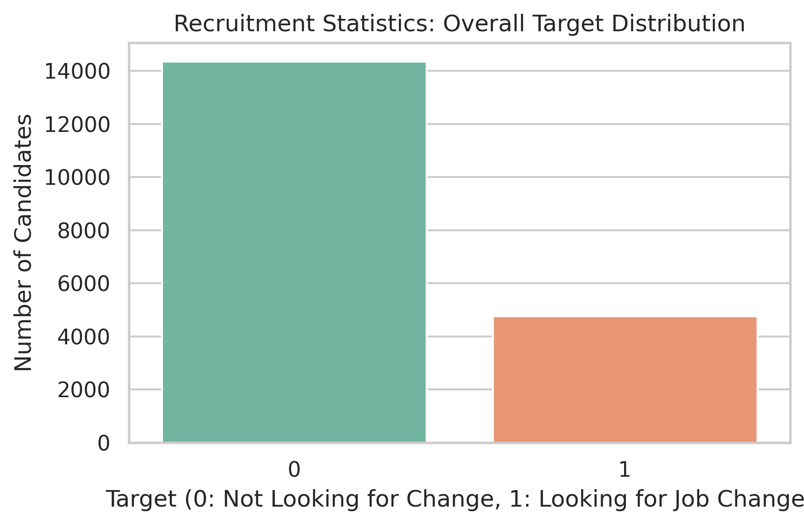
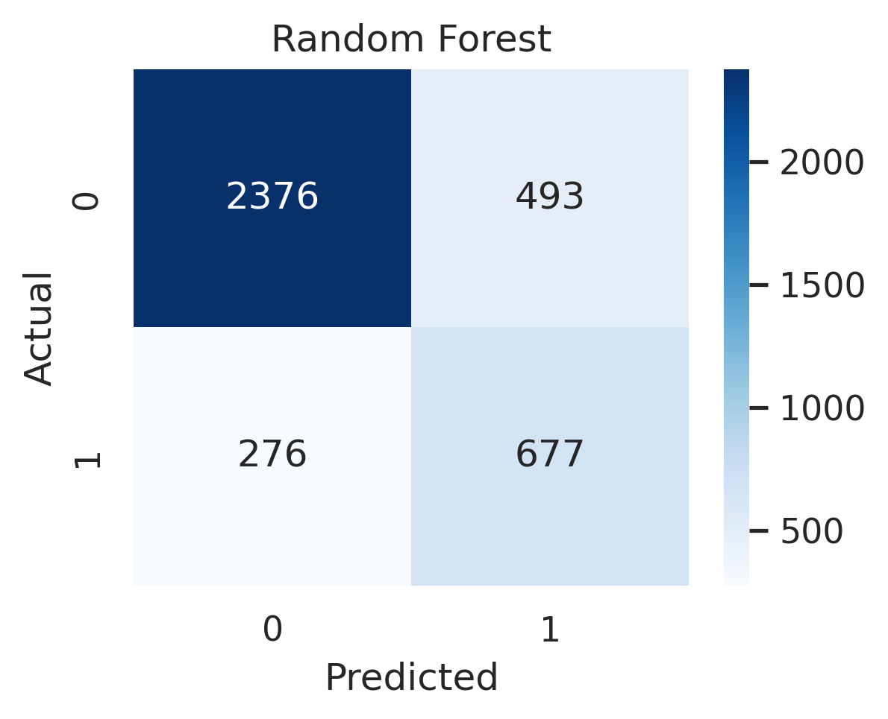
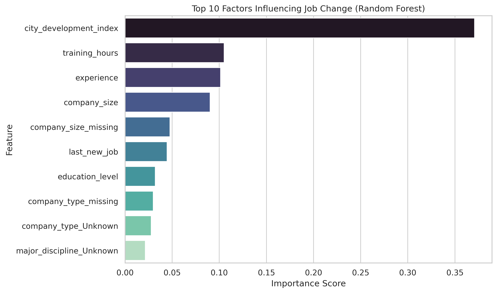

# Smart Recruitment Assistant 🔎


> A machine learning project that estimates how likely a candidate is to be open to a job change, helping recruiters prioritize who is worth contacting first.
> 
> *Built during my AI summer training at the Information Technology Institute (ITI).*

## 📌 The Problem

Only about **1 in 4** candidates in the data is actually looking to change jobs. If a recruiter contacts everyone, most of that effort goes to people who aren't interested. Instead of a simple yes/no answer, this project calculates a probability for each candidate so recruiters can rank and target them effectively.

## 📊 The Dataset

I used the public [HR Analytics: Job Change of Data Scientists](https://www.kaggle.com/datasets/arashnic/hr-analytics-job-change-of-data-scientists) dataset from Kaggle. 

- **Size:** 19,109 candidates (after removing 49 duplicate rows) x 13 columns.
- **Features included:** City development index, education, experience, company size/type, training hours, and last job change.
- **Target:** `1` (looking for a job change) vs `0` (not looking).
- **Distribution:** Highly imbalanced (roughly 25% / 75%).



## ⚙️ Approach & Workflow

* **Data Cleaning:** Dropped the ID column and duplicates. Missing values in gender, company size, company type, and major were filled with `"Unknown"`. For education, university enrollment, experience, and last job change, I imputed the most common value. I also created two flag columns to track missing company size/type, as the "missingness" itself might carry useful information.
* **Feature Engineering:** Converted experience to numeric, flagged relevant experience as binary (1/0), and mapped education level, company size, and last new job into ordinal scales. 
* **Pipeline:** Remaining categorical variables were one-hot encoded and numeric columns were scaled—all bundled inside a single `scikit-learn` pipeline.
* **Modeling:** Split the data 80/20 (stratified) and trained two models: **Logistic Regression** and **Random Forest**. Both were tuned for F1 score using Cross-Validation (Grid Search for LR, Random Search for RF).
* **Threshold Tuning:** Instead of the default 0.5, I selected the decision threshold that maximized the F1 score on the *training data* (leaving the test set completely untouched). For the Random Forest, this optimal threshold was **0.54**.

## 📈 Results

| Model | Accuracy | Precision | Recall | F1 | ROC-AUC |
|---|---|---|---|---|---|
| Logistic Regression | 0.7543 | 0.5052 | 0.7093 | 0.5901 | 0.7825 |
| **Random Forest (Final)** | **0.7988** | **0.5786** | **0.7104** | **0.6378** | **0.7994** |

Because of the imbalanced target, *Accuracy alone is misleading* (a model predicting "no change" every time would hit 75%). This is why I focused on **Recall, F1, and ROC-AUC**. 

The Random Forest outperformed on every metric. In plain words: **Out of 10 candidates who really are open to a change, the model successfully identifies about 7.** When it flags someone as likely to switch, it is correct roughly 58% of the time.



## 🔍 Feature Importance (What the model relies on)

The **City Development Index** was by far the strongest feature (making up ~37% of the total importance), followed by training hours, experience, and company size. Interestingly, whether the company information was missing also made it into the top five features.

*(Note: This only shows what the model uses to make its mathematical predictions; it doesn't necessarily explain the human reasons why people change jobs).*



## ⚠️ Limitations

- **Precision is ~58%**, meaning a fair number of the candidates flagged by the system will not actually switch.
- **Slight Overfitting:** Train F1 (0.677) is slightly higher than Test F1 (0.638).
- **Scope:** It's trained on one specific public dataset and shouldn't be deployed for real hiring decisions without further real-world validation.

## 📂 Repository Structure

- `Smart_Recruitment_Assistant.ipynb` - The full notebook (cleaning, EDA, models, evaluation).
- `aug_train.csv` - The original Kaggle dataset.
- `processed_recruitment_data.csv` - The cleaned dataset.
- `smart_recruitment_rf_model.pkl` - The serialized Random Forest pipeline.
- `images/` - Charts and visualizations exported from the notebook.

## 🚀 How to Run

The original dataset is included in this repo (`aug_train.csv`), so you don't need to download anything else.

1. Open `Smart_Recruitment_Assistant.ipynb` in [Google Colab](https://colab.research.google.com/).
2. In the first data-loading cell, replace the local file path with the raw GitHub link:

```python
import pandas as pd
df = pd.read_csv('[https://raw.githubusercontent.com/yumnasaber/smart-recruitment-assistant/main/aug_train.csv](https://raw.githubusercontent.com/yumnasaber/smart-recruitment-assistant/main/aug_train.csv)')
